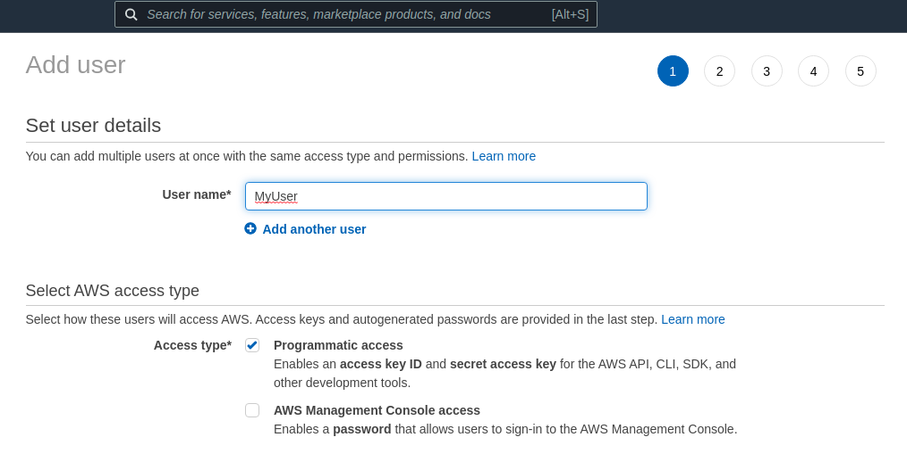

Configure and run the TDEX box easily using Terraform automation. 

<!--truncate-->

### Create a user and obtain AWS Keys

As a first step it is required to obtain AWS access and secret keys. Best practice is to create a new user in AWS IAM. 
Please navigate to Services > IAM page > Add user. 
Open the AWS IAM users page, and click on Add user. Provide user with name and select Programmatic access on the Access type section. 



Next, make sure that your AWS account (access key) has all the required privileges to create EC2 instances and S3 access.
Permissions you need: EC2 full, S3 full and VPC access.


Once you add Permissions and Tags, click Create user. That will bring you to the latest page provided with AWS Access and Secret Keys. 
Copy your keys to a safe place and do not share them with anyone.


Check the documentation [here](https://docs.aws.amazon.com/IAM/latest/UserGuide/id_users_create.html)

- - - - - 
### Install Terraform

Next step is to install Terraform on your machine.
The easiest way is to follow the official documentation [here](https://www.terraform.io/docs/cli/install/apt.html).
For Debian and Ubuntu APT Packages, you can also follow this installation.
```sh
$ curl -fsSL https://apt.releases.hashicorp.com/gpg | sudo apt-key add -
$ sudo apt-add-repository "deb [arch=$(dpkg --print-architecture)] https://apt.releases.hashicorp.com $(lsb_release -cs) main"
$ sudo apt install terraform
```
- - - - - 
### Proceed with cloning and deployment
Clone the TDEX Box repository and enter its directory. 
```sh
git clone https://github.com/tdex-network/tdex-box.git
cd tdex-box
```
- - - - - 

On the AWS AMI Marketplace, find Ubuntu 20.04 public AMI, accessible in the region you are planing to deploy the service and copy its AMI ID. 

Once you have everything in place, just execute deploy.sh and it will prompt you for all the parameters in the same order provided above. 
Since it is good practice to have a backup enabled, please provide S3 bucket a name when deploying. 
Please enter the parameters carefully. 

**Make sure you copy the IP address after the deployment is over.**
This is your TDEX endpoint IP, and it can be accessed over port 9000.
```sh
$ cd terabox/
$ chmod +x deploy.sh
$ ./deploy.sh
```


### Tor

When executing deploy.sh, you can also setup your service behind Tor. 
You can provide your public onion key, or simply leave it empty in order to have the service to generate it for you. 
If generated by the Tor service, we advice you to check your Tor onion public key and register it.

Connect to your Linux box over SSH and get onion key.
```sh
$ ssh -i ~/.ssh/key_location ubuntu@your.tdex.host.ip
$ docker exec tor onions

```

Once you have your Onion public key, please follow [this](https://dev.tdex.network/docs/provider/registry) tutorial on how to register your onion endpoint in the [public TDEX registry ](https://github.com/TDex-network/tdex-registry)


### Install and use TDEX-CLI

TDEX is a CLI (GRPC client), that can be used to interact with a remote TDEX-daemon endpoint. 
We need to init/configure tdex-cli, which is a way of authenticating to the remote running deamon. 
When configuring the service, we need to provide several things:
 - tls_cert_path
 - macaroons_path
 - rpcserver (this will be IP of machine where tdex-box is deployed)

To install TDEX CLI you need to run **getCli.sh** located in scripts folder. If installed successfully tdex-cli will print help menu.

```sh
$ chmod +x terabox/scripts/getCli.sh
$ sudo ./terabox/scripts/getCli.sh
```

Once you have installed tdex-cli, you will need to download the TLS certificate and macaroons from your tdexd host machine in order to connect remotely. This command will download the whole gated/ folder which is a copy of your container deamon. 
```sh
$  scp -r user@your.tdex.host.ip:/path/to/tdexd/ .
```

Configure the tdex-cli with downloaded macaroons and certificate, and add your remote endpoint IP. 
 - cert.pem is located at $HOME/tdex-box/gated/tls/cert.pem on the remote machine
 - admin.macaroon is located at $HOME/tdex-box/gated/macaroons/admin.macaroon on the remote machine
```sh
# By default it looks for the daemon operator gRPC interface on localhost:9000
# or on a remote machine
$ tdex config init --rpcserver=tdex.remote.host.ip:9000 --tls_cert_path=./cert.pem --macaroons_path=./admin.macaroon
##### OR you can use the config command to set your values
$ tdex config
$ tdex config set tls_cert_path ./cert.pem
$ tdex config set macaroons_path ./admin.macaroon
$ tdex config set rpcserver tdex.remote.host.ip 


After those are set, you can test the TDEX daemon
$ tdex listmarket
$ tdex help   <-- for more information and commands
```
For more information [how to configure and use the TDEX CLI](https://dev.tdex.network/docs/provider/daemon/getting_started/configure_cli)
### Deposit funds
**Done!** Now you are ready to [deposit funds](https://dev.tdex.network/docs/provider/daemon/deposit_funds) to open a market and earn swap fees.
